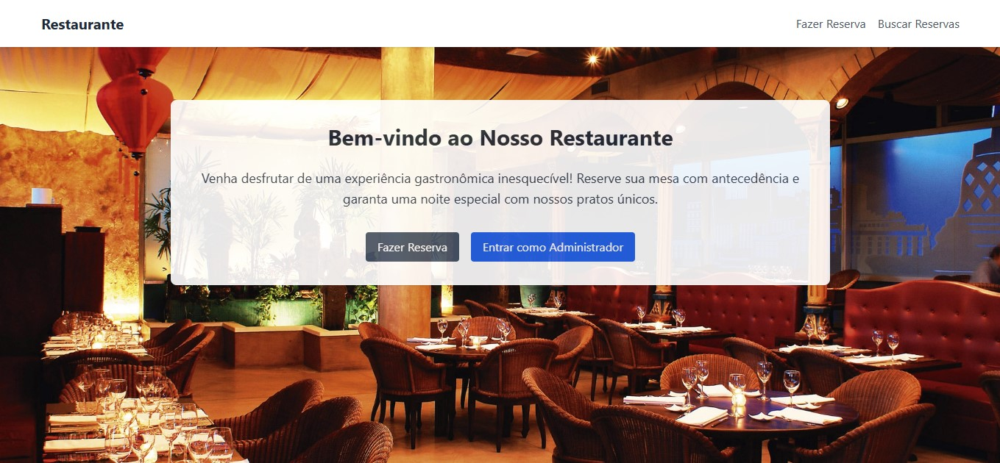

# Sistema de Reservas para Restaurante

## Descrição
O **Sistema de Reservas para Restaurante** é uma aplicação web desenvolvida para permitir o gerenciamento e agendamento de reservas de mesas de forma simples e eficiente.

## Funcionalidades
- **Clientes:**
  - Realizar reservas de mesas.
  - Visualizar reservas feitas.

  
- **Administradores:**
  - Gerenciar as reservas.
  - Visualizar todas as reservas feitas no restaurante.
  - Autenticação segura utilizando **JWT** (JSON Web Token).
## Tecnologias Utilizadas
- **Frontend:** React, Vite, TailwindCSS, Axios
- **Backend:** Node.js, Express, MongoDB, JWT
- **Outras:** React Router, React Hook Form, Date-fns

## Demo
Você pode acessar a aplicação através do seguinte link:

[Visite o sistema de reservas](https://sistema-de-reservas-front.onrender.com/)



## Como Rodar o Projeto Localmente

1. Clone o repositório:

   ```bash
   git clone https://github.com/eoivo/sistema-de-reservas
   ```

2. Navegue até a pasta do projeto:

   ```bash
   cd sistema-de-reservas
   ```

3. Instale as dependências do frontend e do backend:

   Para o frontend:
   ```bash
   cd frontend
   npm install
   ```

   Para o backend:
   ```bash
   cd backend
   npm install
   ```

4. Execute o backend:

   ```bash
   npm run dev
   ```

5. Execute o frontend:

   ```bash
   npm run dev
   ```

6. Acesse o projeto no navegador em `http://localhost:5173`.

## Licença
Este projeto está licenciado sob a MIT License.
